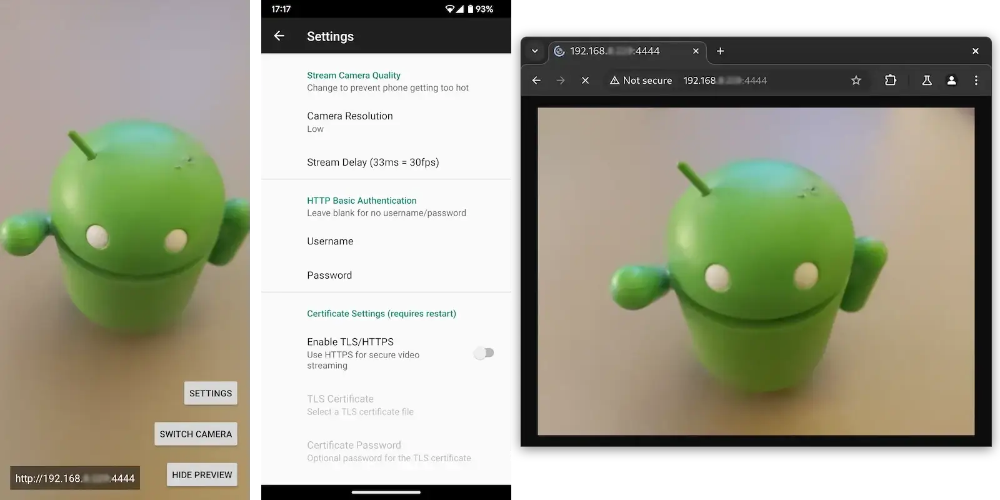

# ADAS3 Client

ADAS3 Client - Android application for streaming camera, audio, and TinySA spectrum analyzer data

## Install

## Features

- 🌎 Built in server, just open the video stream in a web browser, video app or even set it as a Home Assistant MJPEG IP Camera
- 📴 Option to turn the display off while streaming
- 🤳 Switch between the main or selfie camera
- 🖼️ Choose between different image quality settings and frame rates (to help reduce phone over heating)
- 🛂 Optional username and password
- 🔐 Optional TLS certificate support to protect stream and login details via HTTPS

## ⚠️ Warning

If you are planning to run this 24/7, please make sure that your phone does not stay at 100% charge. Doing so may damage the battery and cause it to swell up, which could cause it to explode.

Some models include an option to only charge to 80%, make sure this is enabled where possible.

Note: running at a higher image quality may cause some phones to over heat, which can also damage the battery.

## HTTPS/TLS certificates

To protect the stream and the password from being sent in plain-text over HTTP, a certificate can be used to start the stream over HTTPS.

To generate a new self-signed certificate, clone this repo and run `./scripts/generate-certificate.sh` then use the `server.p12`. Or if you have your own domain you can use [Let's Encrypt](https://letsencrypt.org) to skip the self-signed security warning message.
